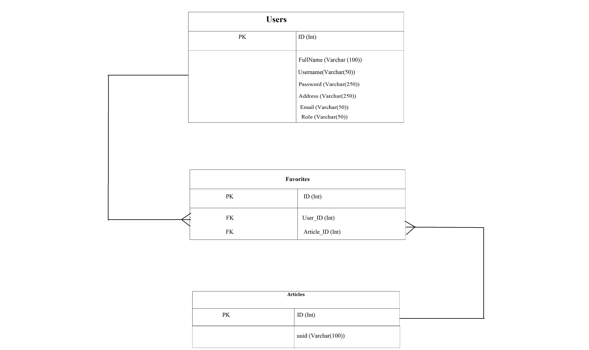
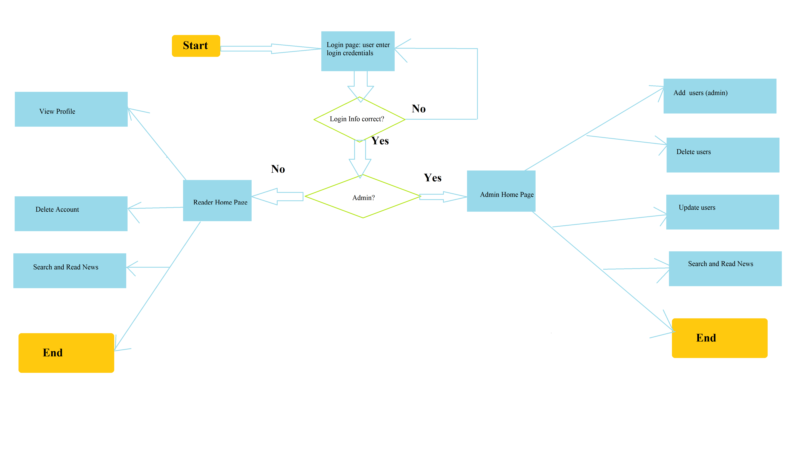

<h1>Search worldwide news Project Proposal</h1>

<B>I.	Introduction and Objective</B>

News is the information mainly used to inform the public about events that are around them and may affect them. Often it is for entertainment purposes too; to provide a distraction of information about other places people are unable to get to or have little influence over. News can make people feel connected too. This results in the availability of many news channels in the world. This became a challenge to find news for the readers. Thus, the purpose of this project. 
The search worldwide news project will help the readers of news to be able to easily find the news that they want to read by searching it using different values such as news source, author, title, date published, or a keyword in the news. 

<B>II.	Problematique</B>

The problem for readers is to find the news in the multiple news channels and news websites available. 

<B>III.	Methodology and Tools</B>

This project has two phases: firstly I will analyze the database from the given API and implement it. Secondly, I will do the coding for the application. Lastly I will test the application to make sure that it responds according to the requirement.
The project will use the following languages:
-	For the database I will use Postgresql with sqlAlchemy
-	For programming I will use Python, JQuery, Html, CSS, JavaScript, JSON
-	I will use the API available on the link  https://newsapi.org/ 
IV.	Database Schema
The database of this project called “news_db” will have the below tables:
-	Users
-	favorites

Below is the database diagram:

 

This project will have sensitive information such as the password of users that I will encrypt.

<b>V.	Functionalities</b>

The main functionalities of the project will be:
-	add_user, update_user and delete_account the function that will allow admin to create/update/delete users (Create, Update and Delete)
-	register, update_profile and delete_account the function that will allow users to register, update their profile, or delete their account to the system by performing create/update/delete users (Create, Update and Delete)

-	Login to the site
-	Search to be able to find news 
-	Read news (Read)
-	Logout 

<b>VI.	UserFlow Diagram</b>
 
 
  

 

<b>VII. Stretch goal</b>

My future goals are to allow readers to be able to add modify their password once forgotten, and allow them to add comments to articles.
